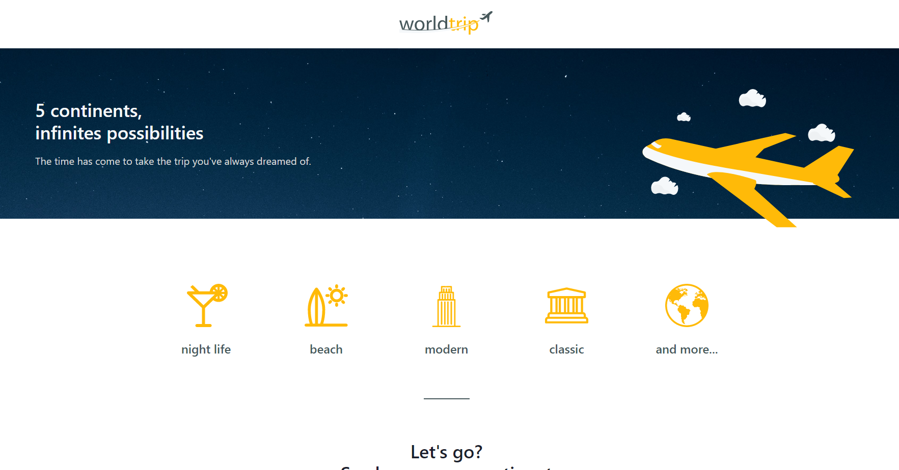

<!-- Logotipo -->
<div align="center">
  
</div>

<!-- Title -->
<h1 align="center"> Rocketseat 🔥 Ignite ReactJS and NextJS </h1>



<!-- Sobre o Projeto -->

## 🧐 Sobre o Projeto

World Trip é um site de viagens, com várias dicas e informações para viajantes.

## 💻 Rodando o Projeto

```
# Abra um terminal e copie este repositório com o comando
$ git clone https://github.com/lucasbarque/WorldTrip.git

# Acesse a pasta da aplicação
$ cd WorldTrip

# Instale as dependências
$ yarn

# Inicie a aplicação
$ yarn dev

```

© 2022 GitHub, Inc.
Terms
Privacy
Security
Stat
